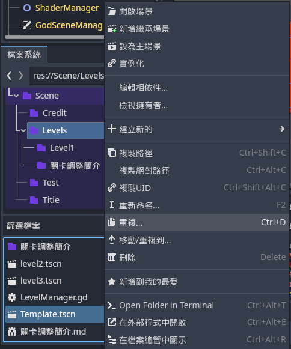
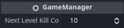
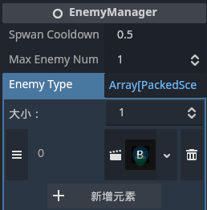

1.	建立新關卡
>	
>
>	在關卡文件夾(res://Scene/Levels)中的Template.tscn右鍵選擇"重複" \
>	改名為對應的關卡名稱並打開此新建的文件

2.	調整通關所需擊殺數
>	
>	
>	選擇名為"GameManager"或最上層的節點 \
>	修改"Next Level Kill Count"參數
>	>	當擊殺數等於此數值時將進入下一關

3.	調整出現怪物
>	
>
>	選擇名為"EnemyManager"的節點並修改參數
>
>	Spwan Cooldown(SPWAN_COOLDOWN):	生成冷卻
>	>	不論生成是否成功, 每次生成後都會等待此數值的時間(秒)才會再次生成 \
>	>	若此參數<0, 將不會生成敵人
>
>	Max Enemy Number(MAX_ENEMY_NUMBER): 最大敵人數量
>	>	若此參數<=0, 將不會限制敵人數量
>
>	Enemy Type(ENEMY_TYPE): 生成的敵人種類列表
>	>	生成時會在此列表中隨機選擇敵人 \
>	>	可以填空, 若選擇到空的目標則當作生成失敗 \
>	>	若相同的敵人種類越多則越容易出現 \
>	>	可以拖動敵人文件夾(res://GameSystem/EnemyManager/Enemys)中的敵人文件(.tscn)到格子內
